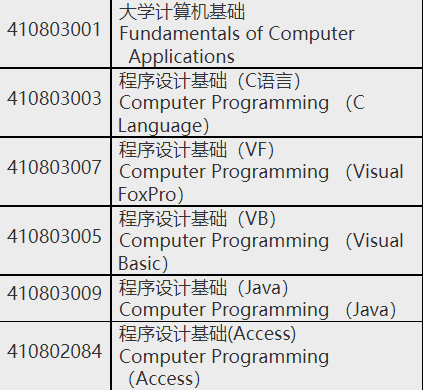

# 玖佰的 C 语言之旅

Dedicated to Hyh. --Epsilon Luoo,2022.01.31.

## 前言（未完待续）

很高兴这个教程终于跟你见面了。大概10月末，我就开始着手编写一个关于 C 语言的通俗易懂的教程，当然，主要是为了你以后万一要学 C 语言的课，提前做的准备。~~我看过你们的培养计划，你们可以在很多门课里面选一门。~~

不用说，我肯定是建议选 **C 语言**，

## 环境配置
想让代码在电脑上运行起来？这是很多人被 C 语言劝退的第一步。我已经把该下载的东西打包好了，点链接下载就行了。如果只是为了应付应付作业，考试什么的，期末过了之后再也不想再碰 C 语言了，那我推荐的是 [***啊哈 C***](https://static.codeaha.com/app/AhaCppInstall.exe) （如果这个链接点不开的话,请及时[联系我](mailto:anine09@pm.me)）。直接下载、安装、运行就行了。