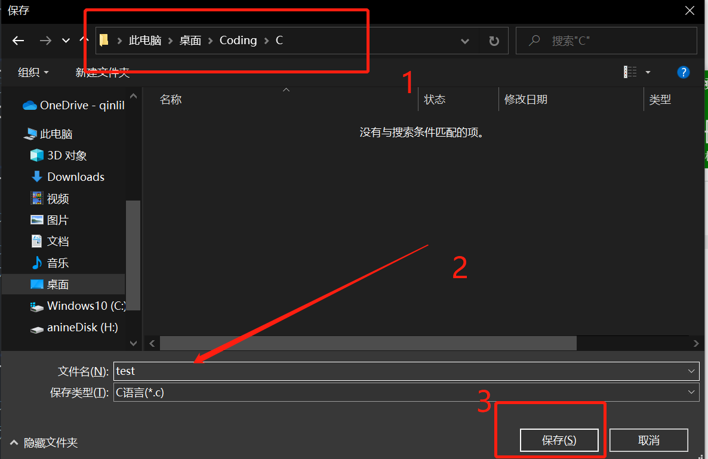

# 玖佰的 C 语言之旅

Dedicated to Hyh. —— Epsilon Luoo, 2022.01.31

## 前言（未完待续）

很高兴这个教程终于跟你见面了。大概10月末，我就开始着手编写一个关于 C 语言的通俗易懂的教程，当然，主要是为了你以后万一要学 C 语言的课，提前做的准备。~~我看过你们的培养计划，你们可以在很多门课里面选一门。~~


不用说，我肯定是建议选 **C 语言**，

## 环境配置

想让代码在电脑上运行起来？这是很多人被 C 语言劝退的第一步。我已经把该下载的东西打包好了，点链接下载就行了。如果只是为了应付应付作业，考试什么的，期末过了之后再也不想再碰 C 语言了，那我推荐的是 ***啊哈 C*** 。如果以后还会接触编程，然后又想要更棒更酷的体验，我推荐 ***VScode + MinGW***。

### 前期准备

我个人建议，找个自己记得住的位置（比如说 **桌面** 、**文档** 这种地方），新建个文件夹，用来存放全部跟编程有关的东西，命名为 **“Coding”** 或者 **其他什么名字** （“Coding”的意思是“写代码”）。然后在文件夹里面 **新建两个文件夹**，命名为 **Software**（用来放写代码要用的软件） 和 **C** （用来放你写的代码）。这样要是不想再写代码了，直接把 **Coding** 扔到回收站就行了。（当然，要先卸载相关软件，再删文件）。


### 使用“啊哈 C”运行 C 语言程序

1. 下载 [***啊哈 C***](https://static.codeaha.com/app/AhaCppInstall.exe) （如果这个[**链接**](https://static.codeaha.com/app/AhaCppInstall.exe)点不开的话,请及时[**联系我**](mailto:anine09@pm.me)）。
2. 运行安装程序，点击右下角的**自定义安装**。建议把安装路径改成刚刚的 **Software**。

   
3. 这里注意一下, **不要勾选开机自启动**，自启动太多了电脑会特别卡，没必要自启的就不用勾。

   

   至于这个**添加桌面快捷方式**，我个人是不喜欢，我习惯用 utools 来启动我的软件，为了让桌面保持干净，看的清楚我的壁纸。
4. 安装完成之后，点**立即体验**。它应该会要求登陆，随便选个登陆方式就行了，我这次是微信扫一扫。
   

   后面它又会要求绑定手机，在下方有个**以后再说**。

   
5. 如果选择了创建快捷方式，这时候桌面会有俩东西。**啊哈 C** 和 **啊哈 C++**。

   

   它俩对我们现在的教程来说用谁都一样，当然，用 **啊哈 C** 更好，我现在是 C++ 方向的，我在写这个教程的时候还在头痛，想着怎么样才不会不小心把 C 语言的代码写成 C++ 的。
6. 打开 **啊哈 C** 之后我们会看到这样的界面。

   

   当然，我们现在还没有正式的学习怎么写代码，所以我这里先写个简单的测试程序。你会看到，我把图中**第5行**（也就是 ***return 0;***  的前面）添加了一行代码：

   ```c
   prinf("Hyh.");
   ```
   我们暂时不用管这行代码代表什么，继续操作就行了。
7. 我们点击上面的**运行**按钮。

   

   这个时候，它会弹出一个文件选择框。我们在这个选择框里面打开之前新建好的 **C** 文件夹，再在下面给这个代码文件起个名字，就叫 **test** 吧，虽然有点随意。**再保存就行了**。

   

   只要你的电脑弹出了一个跟我下面这个图一样的黑不溜秋的框框，那就成功了，恭喜！

   
