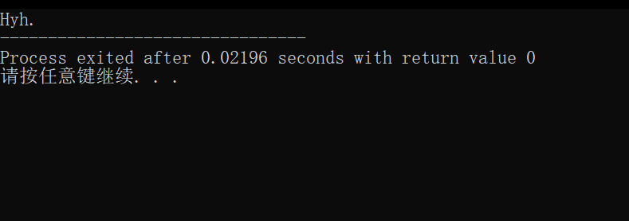

# 玖佰的 C 语言之旅

Dedicated to Hyh. —— Epsilon Luoo, 2022.01.31

## 前言（未完待续）

很高兴这个教程终于跟你见面了。大概10月末，我就开始着手编写一个关于 C 语言的通俗易懂的教程，当然，主要是为了你以后万一要学 C 语言的课，提前做的准备。~~我看过你们的培养计划，你们可以在很多门课里面选一门。~~


不用说，我肯定是建议选 **C 语言**，

## 环境配置

想让代码在电脑上运行起来？这是很多人被 C 语言劝退的第一步。我已经把该下载的东西打包好了，点链接下载就行了。如果只是为了应付应付作业，考试什么的，期末过了之后再也不想再碰 C 语言了，那我推荐的是 ***啊哈 C*** 。如果以后还会接触编程，然后又想要更棒更酷的体验，我推荐 ***VScode + MinGW***。

* ### 前期准备

我个人建议，找个自己记得住的位置（比如说 **桌面** 、**文档** 这种地方），新建个文件夹，用来存放全部跟编程有关的东西，命名为 **“Coding”** 或者 **其他什么名字** （“Coding”的意思是“写代码”）。然后在文件夹里面 **新建两个文件夹**，命名为 **Software**（用来放写代码要用的软件） 和 **C** （用来放你写的代码）。这样要是不想再写代码了，直接把 **Coding** 扔到回收站就行了。（当然，要先卸载相关软件，再删文件）。


* ### 使用“啊哈 C”运行 C 语言程序

1. 下载 [***啊哈 C***](https://static.codeaha.com/app/AhaCppInstall.exe) （如果这个[**链接**](https://static.codeaha.com/app/AhaCppInstall.exe)点不开的话,请及时[**联系我**](mailto:anine09@pm.me)）。
2. 运行安装程序，点击右下角的**自定义安装**。建议把安装路径改成刚刚的 **Software**。

   
3. 这里注意一下, **不要勾选开机自启动**，自启动太多了电脑会特别卡，没必要自启的就不用勾。

   

   至于这个**添加桌面快捷方式**，我个人是不喜欢，我习惯用 utools 来启动我的软件，为了让桌面保持干净，看的清楚我的壁纸。
4. 安装完成之后，点**立即体验**。它应该会要求登陆，随便选个登陆方式就行了，我这次是微信扫一扫。
   

   后面它又会要求绑定手机，在下方有个**以后再说**。

   
5. 如果选择了创建快捷方式，这时候桌面会有俩东西。**啊哈 C** 和 **啊哈 C++**。

   

   它俩对我们现在的教程来说用谁都一样，当然，用 **啊哈 C** 更好，我现在是 C++ 方向的，我在写这个教程的时候还在头痛，想着怎么样才不会不小心把 C 语言的代码写成 C++ 的。
6. 打开 **啊哈 C** 之后我们会看到这样的界面。

   

   当然，我们现在还没有正式的学习怎么写代码，所以我这里先写个简单的测试程序。你会看到，我把图中**第5行**（也就是 ***return 0;***  的前面）添加了一行代码：

   ```c
   prinf("Hyh.");
   ```

   我们暂时不用管这行代码代表什么，继续操作就行了。
7. 我们点击上面的**运行**按钮。

   

   这个时候，它会弹出一个文件选择框。我们在这个选择框里面打开之前新建好的 **C** 文件夹，再在下面给这个代码文件起个名字，就叫 **test** 吧，虽然有点随意。**再保存就行了**。

   

   只要你的电脑弹出了一个跟我下面这个图一样的黑不溜秋的框框，那就成功了，恭喜！

   

* ### 使用“VSCode”运行 C 语言程序 （未完待续）

---

## 第一行代码

在配置好环境之后，我们就可以写下我们的第一行代码啦。在这里我介绍个程序员的传统，一般在新电脑配置好之后，我们的第一行代码都是 _Hello，World！_ 用来检查环境是否配置成功，代码是否可以正常运行。下面我们就以 _Hello，World！_ 的代码为例，进行详细的分析。

```c
#include<stdio.h>

int main(){
  
    printf("Hello，World！");

    return 0;
}
```

你以后会很清楚的看见，我写的代码会跟其他的教材上的空格换行符号啥的不太一样，这是我的编码风格，只是为了简洁好看，`<u>`不影响程序运行 `</u>`。有时候我会省略一些东西，同样的也不影响程序的运行，我不喜欢一开头就扔一大堆看不懂的东西给新手，除了让他们更讨厌学 C 语言之外什么用都没有。

### 头文件

首先我们来看第一行代码

```c
#include<stdio.h>
```

这行代码表示，我要借用一个**工具箱**，工具箱的名字叫  _**stdio.h**_ ，它是个**头文件**（ .h 代表 head ） ， _**stdio**_ 其实就是 **Standard Input Output （标准输入输出）** 的缩写，我们不需要死盯概念，这是我认为初学者不好学 C 语言的问题所在，一开头就摆出乱七八糟的专有名词，搞得大家都没兴趣继续学下去了。

我们这样理解，写程序会用到一些 `<u>`别人早就帮我们写好的代码 `</u>`，这个概念你以后会经常用到，就是：我们会经常用别人早就写好的代码。在业内有句话：**“不要重复发明轮子。”** 所以，引用别人的代码是件习以为常的事情。回到这个地方,  _**#include<XXX.h>**_ 就相当于告诉计算机，我需要借用一个叫做 **XXX.h** 的工具箱，现在在这个程序中，工具箱的名字就是 _**stdio.h**_，这个工具箱里面包含了你以后会经常用到的两个工具（当然它里面不止两个工具，我们以后可能会深入讨论它） ， _**printf( )**_ 和 _**scanf( )**_，放心，我后面肯定会详细介绍它们的，再给你预告一下，你以后可能会经常用到另一个工具箱，叫做 _**math.h**_，“箱”如其名，它里面有很多跟数学有关的工具。那么我们怎么使用它呢，当然是依葫芦画瓢啦。把**下面的代码**写在**开头**，第一行啊第二行这种位置，只要保证它在 _**int main( )**_ 的前面就行了。

```c
#include<math.h>
```

### 程序入口

第二行代码是

```c
int main(){


}
```

在英语中，**main** 有 **主要的** 的意思，所以我们习惯把 _**main( )**_ 称为**主函数**。这里的概念有些复杂，我打算留到后面讲，目前你需要了解：`<u>`C语言的代码都是从 _**main( )**_ 的花括号 **{ }** 中的内容开始的，也就是说， _**int main( ){XXX}**_ 中的 **XXX** 将是第一行被运行的代码 `</u>`，OK，我们不需要强迫自己理解清楚这个概念，在后面编译的 part 我们会更深入的讨论这个问题。`<u>`**注意！！！ 不要把 _main( )_ 写成 _mian( )_，不要写成 面函数，人家叫主函数，**`</u>` 实在是见过太多人这样写了，一弄反，程序就会显示一大堆乱七八糟你暂时还看不懂的英文，看到这么大一坨英文，是很令人头痛的事情，多注意一下，我相信你是个很细心的人。

### 主函数返回值

还有个代码，它是长这样的：

```c
return 0;
```

每一个函数都有返回值，就像数学的函数代值进去能得到一个值一样，类似于如果我们有 **f(x) = y**，那么在这个程序里面，_**main( )**_ 代表的就是 **f(x)**，这个 _**0**_ 就是得到的值： **y**。如果你觉得别扭的话，比如为什么 _**main( )**_ 的括号里面没写东西呢？人家 **f(x)** 里面至少有个 **x** 嘛。其实是有的，比如有一种写法是 _int main( intargc,char\*\*argv[ ] )_。我省事把它简写了，你可能会碰到老师这样写：_void main(void)_，别管这个，`<u>`按照我下面给你的模板来写，会避免许多不必要的麻烦 `</u>`。这句话代表着使用 _**main()**_ 函数后，`<u>`程序会反馈个 _**0**_ 给计算机的操作系统（它是程序的老大）`</u>`，来表示你的程序是正常的结束了（即运行过程中没有出现异常），当然，你不用特殊手段是**看不到这个 _0_ 的**，目前我们不必深究这个，后面我会详细讲解。**不要忘了结尾有个分号 _";"_。**

### 模板

这个是一个好习惯，我希望你每次写 C 语言的时候，能想都不想的先打出下面的代码。虽然这个格式大概率会跟你老师教你的，或者课本的有些许出入，但是，玖佰，请相信我。

```c
#include<stdio.h>

int main(){


    return 0;
}
```

多练习几次，多打几次，手就有肌肉记忆了，很有用。**不要忘了分号。**

### 输出函数

看看这行代码

```c
printf("Hello,World!");
```

输出有多种形式和方法，叫 _**printf( )**_ 输出函数其实不严谨，不然我们叫它**打印函数**吧哈哈哈哈，它的功能就是把你写在 **"XXX"** 里的 **XXX**，显示在那个黑不溜秋的框框里面，一般我们会写 **Hello,World!** 这是我们的传统。讲个笑话，我们 C 语言的老师把 **World** 写成了 **Word** 。下面这个图就是当时他发给我们的文件。


你可能在书上看到的更多的是这个代码：

```c
prinf("Hello,World!\n");
```

这里的 _**\n**_，是一种 **转义符**，代表将光标另起一行，就跟你打完字按个回车的效果一样。本着不必要就不多讲的原则，我们先不用了解 **转义符** 的概念，后面有的是时间讲。

我们回到 _**printf( )**_ 的上面去。你说这个 **print** 我认识，不就是 **打印** 嘛。但是它为什么要写成 **printf** 啊，看着特别奇怪。其实这个 **f** 代表的是格式化的意思，**format**。`<u>`**printf = print + format** （print + f，格式化输入）`</u>` 我们可以类比下之前稍微提过一次的  _**scanf( )**_  函数，它也是英语单词 **扫描** 加了个格式化（**scan + f**）。什么叫**格式化输入输出**我们以后会很详细的讨论，这里我们不需要担心。**不要忘了结尾要写分号！**

### 小结

可能到这部分会让你有点吃力，因为我还是一次性给了太多新的概念给你，主要是为了让玖佰你能用更短的阅读时间，就能够去应付老师的作业。我这章把一个完整的程序其中重要的部分都简略的讲解了一遍，也就是说看完这一章，还是跟以前的我们物理上的要求一样，对我上面所有说到的东西，再次碰到的时候，只要大概有个印象就行，不强求掌握，这样学起来太吃力了，我们循序渐进、深入浅出就好。

我们来小结一下。首先，对于学校的第一次课，我们学到了第一个完整的程序，它长这个样子：

```c
#include<stdio.h>

int main(){

   printf("Hyh.");

   return 0;
}
```

会有些不一样，但是这也是正确的，看看这个东西，争取跟它混个脸熟。

在这个程序里面，有以下几个要点：

1. _**stdio.h**_ 是工具箱的名字， _**#include<stdio.h>**_ 的作用是告诉计算机，你打算使用 _**stdio.h**_ 这个工具箱。
2. 不要把 主函数 _**main( )**_ 写成 _**mian( )**_，我们暂时不需要知道为什么要写这东西。
3. 请注意，上面的程序在 _**printf("Hyh.");**_ 和 _**return 0;**_ 后面结尾都会跟个分号 “_**;**_”，`<u>`请保证写代码的时候所有的标点符号都是英文的 `</u>`，输入中文的标点符号会报错，请尽量避免在写程序的时候涉及到中文，会产生些不必要的麻烦。

暂时就要交代这些，如果碰到问题请及时联系我，对于你，我随时在线，我们下一章再见。

## 数据类型概述

### 变量

首先我们来介绍一下 **变量** 这个概念。`<u>`**变量** 的本质是个符号 `</u>`，就像姓名是我们的符号一样。姓名这个符号指代的是一个具体的人，`<u>`**变量** 这个符号指代的是一个 **“存储区域”**。`</u>`

### 汇编语言引入

我们稍微提及下另一个东西。玖佰一定听说过，**计算机里所有的东西都用二进制表示**。我们可以合理的产生个疑惑，计算机是怎么区分出什么东西是文字，什么又是图片、视频、音频、软件这些？当然，你脑子里面可能很快就有个想法，用文件后缀名啊，比如 .txt 表示的是文本， .mp3 是个音频， .jpg / .png 是图片（这个你可能最熟悉了，相机拍摄和后期出片的常用格式）。但是我想说的跟这个还是有些区别的，我们说的专业一点，我们只关注俩玩意： **数据** 和 **程序**。这俩在计算机里面都是用二进制来表示的，那么计算机是怎么知道哪一堆 0 和 1 是数据，哪一堆又是程序呢。我写汇编语言的程序来说明这个问题。如下图：


我来简单解释一下，

| 地址      | 数据   | 程序        |
| --------- | ------ | ----------- |
| 073F:0100 | B80001 | MOV AX,0100 |
| 073F:0103 | 89C3   | MOV BX,AX   |

